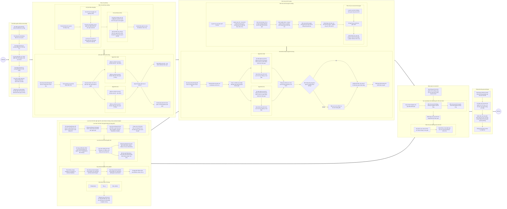

```mermaid
flowchart LR
    Start((("Bắt đầu")))
    End((("Kết thúc")))

    subgraph StepA["Tìm kiếm nguồn dữ liệu và thu thập"]
        direction TB
        A.1["Xác định nguồn dữ liệu thuộc chủ đề dịch vụ công"]
        A.2["Thu thập toàn bộ đường dẫn tới các câu hỏi"]
        A.3["Thu thập toàn bộ các trường thông tin ở mỗi câu hỏi"]
        A.4["Lấy link dẫn đến các TTHC (kiến thức liên quan) ở tất cả câu hỏi"]
        A.5["Thu thập toàn bộ các trường thông tin ở mỗi TTHC"]
        A.6["Xử lý lỗi và tiến hành thu thập lại những câu hỏi/TTHC còn thiếu"]
        A.7["Tổng hợp và xuất dữ liệu thô bao gồm bộ câu hỏi và kiến thức liên quan (TTHC)"]
        A.1:::clickable
        click A.1 "https://dichvucong.gov.vn/p/home/dvc-cau-hoi-pho-bien.html"
    end

    subgraph StepB_["Tiền xử lý dữ liệu"]
        direction TB
        subgraph StepB["Tiền xử lý dữ liệu tự động"]
            direction LR
            B.1["Tải bộ dữ liệu thô sau khi thu thập xong"]
            subgraph B.2["Xử lý dữ liệu trùng lặp"]
                direction TB
                B.2.1["Xóa dữ liệu trùng lặp (với ngưỡng 0.95)"]
                B.2.2["Tính độ tương đồng cosine giữa các cặp câu hỏi và các cặp câu trả lời"]
                B.2.3["Ưu tiên các câu hỏi có nhiều kiến thức liên quan bằng cách sắp xếp"]
            end
            subgraph B.3["Xử lý dữ liệu bị thiếu"]
                direction TB
                B.3.1["Chỉ giữ lại những câu hỏi có đầy đủ câu trả lời, kiến thức liên quan và bộ ngành"]
                B.3.2["Giữ lại thêm các câu hỏi thiếu bộ ngành để tự điền khuyết thủ công nếu quá ít dữ liệu"]
            end
            B.4["Xuất dữ liệu gồm các câu hỏi đã được tiền xử lý"]
        end

        subgraph StepBH["Làm sạch dữ liệu thủ công"]
            direction LR
            BH.1["Xây dựng Streamlit App để thao tác thuận tiện với dữ liệu"]
            BH.2["Tải bộ dữ liệu sau khi đã được tiền xử lý"]
            BH.3["Chia bộ dữ liệu câu hỏi và kiến thức liên quan thành 2 phần"]
            subgraph BH.4["Người thứ nhất"]
                direction TB
                BH.4.1["Kiểm tra chính tả cho bộ dữ liệu câu hỏi - câu trả lời"]
                BH.4.2["Kiểm tra chính tả cho bộ dữ liệu kiến thức liên quan (TTHC)"]
            end
            subgraph BH.5["Người thứ hai"]
                direction TB
                BH.5.1["Kiểm tra chính tả cho bộ dữ liệu câu hỏi - câu trả lời"]
                BH.5.2["Kiểm tra chính tả cho bộ dữ liệu kiến thức liên quan (TTHC)"]
            end
            BH.6["Gộp bộ dữ liệu đã chia về như cũ"]
            BH.7["Xuất dữ liệu câu hỏi - câu trả lời đã được làm sạch"]
            BH.8["Xuất dữ liệu kiến thức liên quan (TTHC) đã được làm sạch"]
        end
    end

    subgraph StepO["Lựa chọn mô hình ngôn ngữ lớn, siêu tham số chung và tạo prompt template"]
        direction TB
        subgraph O.1["Lựa chọn mô hình mã nguồn đóng (sử dụng API)"]
            direction LR
            O.1.1["Sử dụng OpenRouter để lấy API, giúp đồng bộ mã nguồn và siêu tham số dễ dàng hơn"]
            O.1.2["Bỏ qua những mô hình giải thích, chỉ lựa chọn mô hình sinh ngôn ngữ"]
            O.1.3["Lựa chọn những mô hình phổ biến và phù hợp bao gồm (ChatGPT, Gemini, DeepSeek, Claude)"]
            O.1.4["Trong các mô hình đã chọn, sử dụng GPT-4o-mini để sinh ra câu trả lời ảo giác"]
            O.1.1:::clickable
            click O.1.1 "https://openrouter.ai/"
        end
        subgraph O.2["Lựa chọn mô hình mã nguồn mở"]
            direction LR
            O.2.1["Sử dụng LMStudio để tải các mô hình GGUF mã nguồn mở từ HuggingFace để sử dụng"]
            O.2.2["Lựa chọn những mô hình 7B tham số có đầu ra tốt bằng cách prompt thử"]
            O.2.3["Mô hình phổ biến hỗ trợ đa ngôn ngữ (Llama, Qwen, Mistral, Vicuna, WizardLM)"]
            O.2.4["Mô hình phổ biến được tinh chỉnh trên dữ liệu tiếng Việt (Vistral, Qwen Viet SFT)"]
            O.2.1:::clickable
            click O.2.1 "https://lmstudio.ai/"
        end
        subgraph O.3["Tạo prompt template chứa pattern"]
            direction LR
            O.3.1["Tham khảo prompt template và 4 pattern từ bài báo HaluEval"]
            O.3.2["Xây dựng prompt template chứa pattern cho giai đoạn sinh câu trả lời ảo giác"]
            O.3.3["Xây dựng prompt template chứa pattern cho giai đoạn đánh giá các câu trả lời"]
            O.3.4["Prompt thử nhằm chỉnh sửa để đầu ra được tối ưu"]
            O.3.1:::clickable
            click O.3.1 "https://github.com/RUCAIBox/HaluEval"
        end
        subgraph O.4["Chọn siêu tham số chung"]
            direction TB
            O.4.1["Temperature"]
            O.4.2["Top_p"]
            O.4.3["Max_tokens"]
        end
        O.5["Thống kê các mô hình sẽ sử dụng để đánh giá cùng với siêu tham số và prompt template chung"]
    end

    subgraph StepC_["Sinh câu trả lời ảo giác"]
        direction TB
        subgraph StepC["Sinh câu trả lời ảo giác tự động"]
            direction LR
            C.1["Lấy API của mô hình GPT-4o-mini"]
            C.2["Lấy bộ câu hỏi + câu trả lời và kiến thức liên quan tương ứng từ dữ liệu đã được tiền xử lý"]
            C.3["Lấy các siêu tham số và prompt template đã khởi tạo cho quá trình sinh ảo giác"]
            C.4["Chọn ngẫu nhiên 1 trong 4 pattern để tạo ra prompt cuối cùng ứng với mỗi câu hỏi"]
            C.5["Sinh câu trả lời ảo giác tương ứng với mỗi câu hỏi bằng prompt đã tạo"]
            C.6["Bộ dữ liệu thô chứa các câu trả lời ảo giác + pattern ứng với mỗi câu hỏi"]
            subgraph C.7["Tiền xử lý các câu trả lời ảo giác"]
                direction TB
                C.7.1["Loại bỏ các tiền tố không liên quan trong câu trả lời"]
                C.7.2["Chỉ giữ lại câu trả lời ảo giác sạch"]
                C.7.3["Xuất dữ liệu các câu hỏi cùng với câu trả lời ảo giác + pattern đã được tiền xử lý"]
            end
        end
        subgraph StepCH["Chú thích dữ liệu ảo giác thủ công"]
            direction LR
            CH.1["Xây dựng Streamlit App để thao tác thuận tiện với dữ liệu"]
            CH.2["Tải bộ dữ liệu ảo giác sau khi đã được tiền xử lý"]
            CH.3["Chọn ra 1000 câu sample để đánh giá chất lượng dữ liệu ảo giác"]
            subgraph CH.4["Người thứ nhất"]
                direction TB
                CH.4.1["So sánh giữa câu trả lời đúng và câu trả lời ảo giác được sinh ra và vận dụng kiến thức liên quan"]
                CH.4.2["Gán nhãn câu trả lời sinh ra là 'Có' hay 'Không' có ảo giác"]
            end
            subgraph CH.5["Người thứ hai"]
                direction TB
                CH.5.1["So sánh giữa câu trả lời đúng và câu trả lời ảo giác được sinh ra và vận dụng kiến thức liên quan"]
                CH.5.2["Gán nhãn câu trả lời sinh ra là 'Có' hay 'Không' có ảo giác"]
            end
            CH.6["Tổng hợp dữ liệu các câu trả lời ảo giác đã được chú thích"]
            CH.7{"Đối chiếu kết quả giữa 2 người có giống nhau không?"}
            CH.8["Tiếp tục tra cứu để tìm ra chú thích đúng đắn"]
            CH.9["Xuất bộ dữ liệu các câu trả lời đã được gán nhãn đúng"]
            CH.10["Đánh giá chất lượng của bộ dữ liệu ảo giác"]
        end
    end

    subgraph StepD["Đánh giá các câu trả lời"]
        direction TB
        D.1["Lấy những mô hình mã nguồn mở và đóng cùng với các siêu tham số đã chọn từ trước"]
        subgraph D.2["Tạo ra prompt cuối cùng ứng với mỗi câu trả lời"]
            direction LR
            D.2.1["Lấy prompt template cho giai đoạn đánh giá"]
            D.2.2["Đối với câu trả lời đúng, không có pattern nên để rỗng"]
            D.2.3["Đối với câu trả lời ảo giác, chèn thêm pattern tương ứng"]
        end
        subgraph D.2["Đánh giá các câu trả lời không sử dụng kiến thức liên quan"]
            direction LR
        end
        subgraph D.3["Đánh giá các câu trả lời sử dụng kiến thức liên quan"]
            direction LR
        end
        subgraph D.4["Tiền xử lý các đánh giá của mô hình"]
            direction LR
            D.4.1["Chỉ giữ lại các câu trả lời là 'Có' hoặc 'Không' có ảo giác"]
            D.4.2["Xuất dữ liệu chứa đánh giá của các mô hình đã được tiền xử lý"]
        end
    end

    subgraph StepE["Phân tích kết quả và kết luận"]
        direction TB
        E.1["Xây dựng confusion matrix dựa trên kết quả đánh giá của các mô hình"]
        E.2["So sánh các mô hình mã nguồn mở với nhau, các mô hình mã nguồn đóng với nhau"]
        E.3["Kiểm định việc đưa kiến thức liên quan vào mô hình có làm tăng chất lượng kết quả hay không"]
        E.4["Thống kê kết quả và đưa ra nhận xét"]
    end

    Start ==> StepA
    StepA ==> StepB_
    StepB_ ==> StepC_
    StepC_ ==> StepD
    StepD ==> StepE
    StepE ==> End

    StepO ==> StepC_
    StepO ==> StepD

    StepB ==> StepBH
    StepC ==> StepCH

    A.1 --> A.2
    A.2 --> A.3
    A.3 --> A.4
    A.4 --> A.5
    A.5 --> A.6
    A.6 --> A.7

    B.1 --> B.2
    B.2 --> B.3
    B.3 --> B.4

    B.2.1 --> B.2.2 
    B.2.2 --> B.2.3
    
    B.3.1 --> B.3.2

    BH.1 --> BH.2
    BH.2 --> BH.3
    BH.3 --> BH.4
    BH.3 --> BH.5
    BH.4 --> BH.6
    BH.5 --> BH.6
    BH.6 --> BH.7
    BH.6 --> BH.8

    BH.4.1 --> BH.4.2
    BH.5.1 --> BH.5.2

    O.1 --> O.2
    O.2 --> O.3
    O.3 --> O.4
    O.4 --> O.5

    O.1.1 --> O.1.2
    O.1.2 --> O.1.3
    O.1.3 --> O.1.4

    O.2.1 --> O.2.2
    O.2.2 --> O.2.3
    O.2.2 --> O.2.4

    O.3.1 --> O.3.2 
    O.3.2 --> O.3.3
    O.3.3 --> O.3.4

    C.1 --> C.2
    C.2 --> C.3
    C.3 --> C.4
    C.4 --> C.5
    C.5 --> C.6
    C.6 --> C.7

    C.7.1 --> C.7.2
    C.7.2 --> C.7.3

    CH.1 --> CH.2
    CH.2 --> CH.3
    CH.3 --> CH.4
    CH.3 --> CH.5
    CH.4 --> CH.6
    CH.5 --> CH.6
    CH.6 --> CH.7
    CH.7 --> |Không| CH.8
    CH.7 --> |Có| CH.9
    CH.8 --> CH.9
    CH.9 --> CH.10

    CH.4.1 --> CH.4.2
    CH.5.1 --> CH.5.2

    D.1 --> D.2
    D.2 --> D.3
    D.3 --> D.4

    D.2.1 --> D.2.2
    D.2.2 --> D.2.3
    D.4.1 --> D.4.2

    E.1 --> E.2
    E.2 --> E.3
    E.3 --> E.4

```
