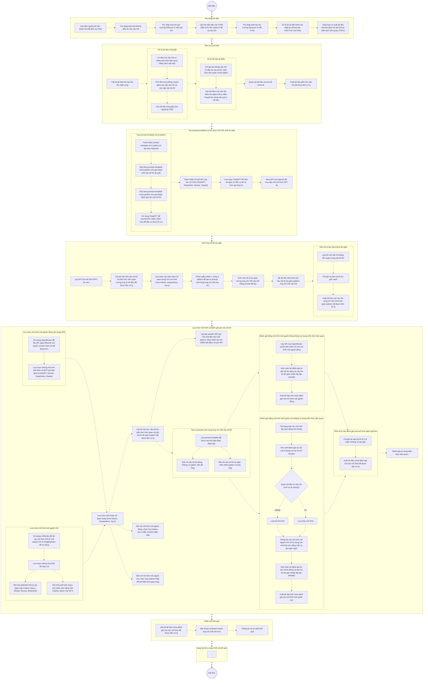

```mermaid
flowchart TB
    Start((("Bắt đầu")))
    End((("Kết thúc")))

    subgraph Step1["Thu thập dữ liệu"]
        direction LR
        1.1["Xác định nguồn dữ liệu thuộc chủ đề dịch vụ công"]
        1.2["Thu thập toàn bộ đường dẫn tới các câu hỏi"]
        1.3["Thu thập toàn bộ các trường thông tin ở mỗi câu hỏi"]
        1.4["Lấy link dẫn đến các TTHC (kiến thức liên quan) ở tất cả câu hỏi"]
        1.5["Thu thập toàn bộ các trường thông tin ở mỗi TTHC"]
        1.6["Xử lý lỗi và tiến hành thu thập lại những câu hỏi/TTHC còn thiếu"]
        1.7["Tổng hợp và xuất dữ liệu thô bao gồm bộ câu hỏi và kiến thức liên quan (TTHC)"]
        1.1:::clickable
        click 1.1 "https://dichvucong.gov.vn/p/home/dvc-cau-hoi-pho-bien.html"
    end

    subgraph Step2["Tiền xử lý dữ liệu"]
        direction LR
        2.1["Tải bộ dữ liệu thô sau khi thu thập xong"]
        subgraph 2.2["Xử lý dữ liệu trùng lặp"]
            direction TB
            2.2.1["Xóa dữ liệu trùng lặp (với ngưỡng 0.95)"]
            2.2.2["Tính độ tương đồng cosine giữa các cặp câu hỏi và các cặp câu trả lời"]
            2.2.3["Ưu tiên các câu hỏi có nhiều kiến thức liên quan bằng cách sắp xếp"]
        end
        subgraph 2.3["Xử lý dữ liệu bị thiếu"]
            direction TB
            2.3.1["Chỉ giữ lại những câu hỏi có đầy đủ câu trả lời, kiến thức liên quan và bộ ngành"]
            2.3.2["Giữ lại thêm các câu hỏi thiếu bộ ngành để tự điền khuyết thủ công nếu quá ít dữ liệu"]
        end
        2.4["Quan sát dữ liệu và sửa lỗi chính tả"]
        2.5["Xuất dữ liệu gồm các câu hỏi đã được tiền xử lý"]
    end

    subgraph Step3["Tạo prompt template và lựa chọn mô hình sinh ảo giác"]
        direction LR
        subgraph 3.1["Tạo prompt template chứa pattern"]
            direction TB
            3.1.1["Tham khảo prompt template và 4 pattern từ bài báo HaluEval"]
            3.1.2["Xây dựng prompt template chứa pattern cho giai đoạn sinh câu trả lời ảo giác"]
            3.1.3["Xây dựng prompt template chứa pattern cho giai đoạn đánh giá các câu trả lời"]
            3.1.4["Sử dụng ChatGPT để prompt thử nhằm chỉnh sửa để đầu ra được tối ưu"]
            3.1.1:::clickable
            click 3.1.1 "https://github.com/RUCAIBox/HaluEval"
            %% 3.1.2:::clickable
            %% 3.1.3:::clickable
            %% click 3.1.2 "https://gist.github.com/fabyanbui/81ffa62c108175925d7f659ac8ccf305#prompt-template-cho-generation"
            %% click 3.1.3 "https://gist.github.com/fabyanbui/81ffa62c108175925d7f659ac8ccf305#prompt-template-cho-evaluation"
        end
        3.2["Tham khảo chi phí API của các mô hình (ChatGPT, DeepSeek, Gemini, Claude)"]
        3.3["Lựa chọn ChatGPT để sinh ảo giác (vì đầu ra tốt và mức giá hợp lý)"]
        3.4["Mua API của OpenAI để truy cập vào mô hình GPT-4o"]
    end

    subgraph Step4["Sinh câu trả lời ảo giác"]
        direction LR
        4.1["Lấy API của mô hình GPT-4o-mini"]
        4.2["Lấy bộ câu hỏi+câu trả lời và kiến thức liên quan tương ứng từ dữ liệu đã được tiền xử lý"]
        4.3["Lựa chọn các siêu tham số quan trọng cho mô hình (max tokens, temperature, top p)"]
        4.4["Chọn ngẫu nhiên 1 trong 4 pattern để tạo ra prompt cuối cùng ứng với mỗi câu hỏi"]
        4.5["Sinh câu trả lời ảo giác tương ứng với mỗi câu hỏi bằng prompt đã tạo"]
        4.6["Bộ dữ liệu thô chứa các câu trả lời ảo giác+pattern ứng với mỗi câu hỏi"]
        subgraph 4.7["Tiền xử lý các câu trả lời ảo giác"]
            direction TB
            4.7.1["Loại bỏ các tiền tố không liên quan trong câu trả lời"]
            4.7.2["Chỉ giữ lại câu trả lời ảo giác sạch"]
            4.7.3["Xuất dữ liệu các câu hỏi cùng với câu trả lời ảo giác+pattern đã được tiền xử lý"]
        end
    end

    subgraph Step5["Lựa chọn mô hình và đánh giá các câu trả lời"]
        direction LR
        subgraph 5.1["Lựa chọn mô hình mã nguồn đóng (sử dụng API)"]
            direction TB
            5.1.1["Sử dụng OpenRouter để lấy API, giúp đồng bộ mã nguồn và siêu tham số dễ dàng hơn"]
            5.1.2["Lựa chọn những mô hình phổ biến và phù hợp bao gồm (ChatGPT, Gemini, DeepSeek, Claude)"]
            5.1.1:::clickable
            click 5.1.1 "https://openrouter.ai/"
        end
        subgraph 5.2["Lựa chọn mô hình mã nguồn mở"]
            direction TB
            5.2.1["Sử dụng LMStudio để tải các mô hình GGUF mã nguồn mở từ HuggingFace để sử dụng"]
            5.2.2["Lựa chọn những mô hình 7B tham số"]
            5.2.2a["Mô hình phổ biến hỗ trợ đa ngôn ngữ (Llama, Qwen, Mistral, Vicuna, WizardLM)"]
            5.2.2b["Mô hình phổ biến được tinh chỉnh trên tiếng Việt (Vistral, Qwen Viet SFT)"]
            5.2.1:::clickable
            click 5.2.1 "https://lmstudio.ai/"
        end
        5.3["Lựa chọn siêu tham số quan trọng (max tokens, temperature, top p)"]
        5.3a["Đối với mô hình mã nguồn đóng, chọn max tokens cao vì đầu ra được đảm bảo"]
        5.3b["Đối với mô hình mã nguồn mở, chọn max tokens thấp để tiết kiệm thời gian chạy"]       
        
        5.4["Lấy bộ câu hỏi, câu trả lời, kiến thức liên quan và câu trả lời ảo giác+pattern đã được tiền xử lý"]
        5.4a["Lấy tập sample 250 câu hỏi chia đều cho mỗi pattern, tổng 1000 câu hỏi nhằm tiết kiệm chi phí API"]
        subgraph 5.5["Tạo ra prompt cuối cùng ứng với mỗi câu trả lời"]
            direction TB
            5.5.1["Lấy prompt template đã được tạo cho giai đoạn đánh giá"]
            5.5.2["Đối với câu trả lời đúng, không có pattern nên để rỗng"]
            5.5.3["Đối với câu trả lời ảo giác, chèn thêm pattern tương ứng"]
        end
        subgraph 5.6["Đánh giá bằng mô hình mã nguồn đóng không sử dụng kiến thức liên quan"]
            direction TB
            5.6.1["Lấy API của OpenRouter và bộ siêu tham số cho mô hình mã nguồn đóng"]
            5.6.2["Sinh toàn bộ đánh giá cả câu trả lời đúng và câu trả lời ảo giác (hoặc lấy tập sample)"]
            5.6.3["Xuất dữ liệu thô chứa đánh giá của mô hình mã nguồn đóng"]
        end
        subgraph 5.7["Đánh giá bằng mô hình mã nguồn mở không sử dụng kiến thức liên quan"]
            direction TB
            5.7.1["Tải hàng loạt các mô hình đã chọn bằng LM Studio"]
            5.7.2["Thử sinh đánh giá cả câu trả lời đúng và câu trả lời ảo giác"]
            5.7.3{"Quan sát đầu ra của mô hình có ổn không?"}
                5.7.3a["Loại bỏ mô hình"]
                5.7.3b["Lựa chọn mô hình"]
            5.7.4["Thống kê các mô hình mã nguồn mở sẽ sử dụng (cả mô hình cho tiếng Việt và đa ngôn ngữ)"]
            5.7.5["Sinh toàn bộ đánh giá cả câu trả lời đúng và câu trả lời ảo giác (hoặc lấy tập sample)"]
            5.7.6["Xuất dữ liệu thô chứa đánh giá của mô hình mã nguồn mở"]
        end
        subgraph 5.8["Tiền xử lý các đánh giá của mô hình ngôn ngữ lớn"]
            direction TB
            5.8.1["Chỉ giữ lại câu trả lời là 'Có' hoặc 'Không' có ảo giác"]
            5.8.2["Xuất dữ liệu chứa đánh giá của các mô hình đã được tiền xử lý"]
        end
        5.9["Đánh giá sử dụng kiến thức liên quan..."]
    end

    subgraph Step6["Phân tích kết quả"]
        direction LR
        6.1["Lấy bộ dữ liệu chứa đánh giá của các mô hình đã được tiền xử lý"]
        6.2["Xây dựng confusion matrix ứng với mỗi mô hình"]
        6.3["Thống kê và so sánh kết quả"]
    end

    subgraph Step7["Quay lại tối ưu quy trình và kết quả"]
        direction LR
        ...
    end

    Start E1@==> Step1
    Step1 E2@==> Step2
    Step2 E3@==> Step3
    Step3 E4@==> Step4
    Step4 E5@==> Step5
    Step5 E6@==> Step6
    Step6 E7@==> Step7
    Step7 E8@==> End

    classDef animateE stroke-dasharray: 9,5,stroke-dashoffset: 900,animation: dash 30s linear infinite;
    class E1,E2,E3,E4,E5,E6,E7,E8 animateE

    1.1 e1_1@--> 1.2
    1.2 e1_2@--> 1.3
    1.3 e1_3@--> 1.4
    1.4 e1_4@--> 1.5
    1.5 e1_5@--> 1.6
    1.6 e1_6@--> 1.7

    classDef animateE1 stroke-dasharray: 9,5,stroke-dashoffset: 900,animation: dash 15s linear infinite;
    class e1_1,e1_2,e1_3,e1_4,e1_5,e1_6 animateE1

    2.1 e2_1@--> 2.2
    2.2 e2_2@--> 2.3
    2.3 e2_3@--> 2.4
    2.4 e2_4@--> 2.5
        2.2.3 e2_5@--> 2.2.2
        2.2.2 e2_6@--> 2.2.1
        2.3.1 e2_7@--> 2.3.2

    classDef animateE2 stroke-dasharray: 9,5,stroke-dashoffset: 900,animation: dash 15s linear infinite;
    class e2_1,e2_2,e2_3,e2_4,e2_5,e2_6,e2_7 animateE2

    3.1 e3_1@--> 3.2
    3.2 e3_2@--> 3.3
    3.3 e3_3@--> 3.4
        3.1.1 e3_4@--> 3.1.2
        3.1.2 e3_5@--> 3.1.3
        3.1.3 e3_6@--> 3.1.4

    classDef animateE3 stroke-dasharray: 9,5,stroke-dashoffset: 900,animation: dash 15s linear infinite;
    class e3_1,e3_2,e3_3,e3_4,e3_5,e3_6 animateE3

    4.1 e4_1@--> 4.2
    4.2 e4_2@--> 4.3
    4.3 e4_3@--> 4.4
    4.4 e4_4@--> 4.5
    4.5 e4_5@--> 4.6
    4.6 e4_6@--> 4.7
        4.7.1 e4_7@--> 4.7.2
        4.7.2 e4_8@--> 4.7.3

    classDef animateE4 stroke-dasharray: 9,5,stroke-dashoffset: 900,animation: dash 15s linear infinite;
    class e4_1,e4_2,e4_3,e4_4,e4_5,e4_6,e4_7,e4_8 animateE4

    5.1 e5_1@--> 5.3
    5.2 e5_2@--> 5.3
    5.3 e5_3@--> 5.4
    5.4 e5_4@--> 5.5
    %% skip e5_5
    5.3 -.-> 5.3a
    %% skip e5_6
    5.3 -.-> 5.3b  
    5.4 e5_7@--> 5.4a
    5.5 e5_8@--> 5.6
    5.5 e5_9@--> 5.7
    5.6 e5_10@--> 5.8
    5.7 e5_11@--> 5.8
    5.8 e5_12@--> 5.9
        5.1.1 e5_13@--> 5.1.2  
        5.2.1 e5_14@--> 5.2.2
        5.2.2 e5_15@--> 5.2.2a
        5.2.2 e5_16@--> 5.2.2b
        5.5.1 e5_17@--> 5.5.2
        5.5.1 e5_18@--> 5.5.3
        5.6.1 e5_19@--> 5.6.2
        5.6.2 e5_20@--> 5.6.3
        5.7.1 e5_21@--> 5.7.2
        5.7.2 e5_22@--> 5.7.3
        5.7.3 e5_23@-->|Không| 5.7.3a
        5.7.3a e5_24@--> 5.7.4
        5.7.3 e5_25@-->|Có| 5.7.3b
        5.7.3b e5_26@--> 5.7.4
        5.7.4 e5_27@--> 5.7.5
        5.7.5 e5_28@--> 5.7.6
        5.8.1 e5_29@--> 5.8.2

    classDef animateE5 stroke-dasharray: 9,5,stroke-dashoffset: 900,animation: dash 15s linear infinite;
    class e5_1,e5_2,e5_3,e5_4,e5_5,e5_6,e5_7,e5_8,e5_9,e5_10,e5_11,e5_12,e5_13,e5_14,e5_15,e5_16,e5_17,e5_18,e5_19,e5_20,e5_21,e5_22,e5_23,e5_24,e5_25,e5_26,e5_27,e5_28,e5_29 animateE5
        
    6.1 e6_1@--> 6.2
    6.2 e6_2@--> 6.3

    classDef animateE6 stroke-dasharray: 9,5,stroke-dashoffset: 900,animation: dash 15s linear infinite;
    class e6_1,e6_2 animateE6

```

